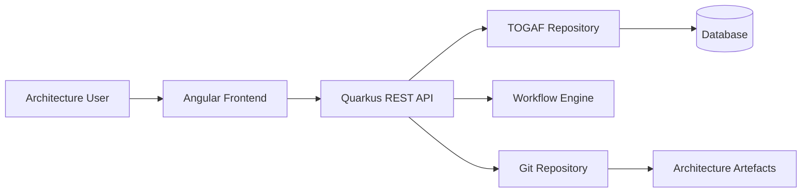

# TOGAFmaate

# TOGAFmate

**TOGAFmate** is an open-source architecture repository and workflow platform designed to help organisations create, manage, govern, and evolve their enterprise architecture using the **TOGAF Architecture Development Method (ADM)**.

TOGAFmate goes beyond being a document repository. It provides a structured **TOGAF Architecture Repository**, together with workflows for creating, reviewing, approving, versioning, and managing architecture artefacts.

The project is designed to make enterprise architecture more practical, collaborative, traceable, and accessible.

TOGAFmate is released under the **GNU General Public License v3.0 (GPL-3.0)**.

## Objectives

TOGAFmate aims to provide:

* A structured **TOGAF Architecture Repository**
* A central place to manage architecture artefacts
* Workflows for creating, reviewing, approving, and maintaining artefacts
* Version control using **Git**
* Reusable sample architecture artefacts
* Traceability between architecture artefacts and decisions
* Support for architecture governance
* A modern web-based user interface
* A containerised deployment model
* An open-source platform that can be extended by the community

## Initial Features

### Architecture Repository

TOGAFmate will provide a structured repository for enterprise architecture information, including:

* Architecture Principles
* Architecture Vision
* Business Architecture
* Data Architecture
* Application Architecture
* Technology Architecture
* Security Architecture
* Architecture Building Blocks
* Solution Building Blocks
* Architecture Requirements
* Architecture Roadmaps
* Architecture Decisions
* Architecture Governance information
* Architecture patterns
* Reference architectures
* Business rules

The repository structure will align with TOGAF concepts while remaining flexible enough to support organisation-specific architecture practices.

### Architecture Artefacts

Users will be able to create, upload, manage, and retrieve architecture artefacts.

Initial artefact capabilities will include:

* Upload existing artefacts
* Create new artefacts
* Store metadata
* Categorise artefacts
* Associate artefacts with TOGAF ADM phases
* Maintain artefact versions
* Search and retrieve artefacts
* Download artefacts
* Mark artefacts as draft, under review, approved, or retired

### Artefact Workflow

TOGAFmate will provide workflow capabilities rather than treating artefacts as simple files.

An initial workflow will support states such as:

```text
DRAFT
   ↓
UNDER_REVIEW
   ↓
APPROVED
   ↓
PUBLISHED
   ↓
RETIRED
```

Workflow capabilities will eventually include:

* Submit artefact for review
* Assign reviewers
* Review and provide comments
* Approve or reject artefacts
* Publish approved artefacts
* Retire obsolete artefacts
* Maintain an audit trail
* Track who performed workflow actions

The workflow will be designed so that organisations can evolve it as their governance requirements mature.

### Git-Based Version Control

TOGAFmate will use **Git** internally for version control rather than attempting to reinvent version-management functionality.

Git will provide the underlying mechanism for:

* Version history
* Change tracking
* Branching
* Commits
* Comparing versions
* Restoring previous versions
* Traceability of changes

TOGAFmate will provide the architecture-specific repository and workflow capabilities around Git.

### Sample Architecture Artefacts

TOGAFmate will provide a collection of sample architecture artefacts that can be used for:

* Learning TOGAF
* Demonstrating architecture concepts
* Training
* Proof-of-concept projects
* Architecture workshops
* Understanding TOGAF ADM deliverables

Sample artefacts may include:

* Architecture Principles
* Stakeholder Maps
* Business Capability Models
* Business Process Models
* Application Landscapes
* Data Models
* Technology Architecture Models
* Architecture Roadmaps
* Architecture Decisions
* Reference Architectures

Users will also be able to upload their own artefacts.

### Search and Discovery

The repository will provide mechanisms to find architecture information quickly.

Initial capabilities will include searching by:

* Artefact name
* Description
* TOGAF ADM phase
* Artefact type
* Architecture domain
* Tags
* Status
* Version
* Author

Future versions may introduce more advanced semantic and AI-assisted discovery.

## Architecture

TOGAFmate will use a modern microservice-based architecture.



### Technology Stack

| Component        | Technology                      |
| ---------------- | ------------------------------- |
| Frontend         | Angular                         |
| Backend          | Java / Quarkus                  |
| API              | REST                            |
| Version Control  | Git                             |
| Build            | Gradle                          |
| Testing          | JUnit                           |
| Code Coverage    | JaCoCo                          |
| Code Quality     | SonarQube                       |
| Containerisation | Docker                          |
| IDE              | IntelliJ IDEA Community Edition |

The initial implementation will be designed to run locally using Docker and will also support development directly from IntelliJ IDEA Community Edition.

## Development Principles

TOGAFmate will follow several development principles:

* Open source
* API-first development
* Separation of frontend and backend
* Automated testing
* Continuous code-quality analysis
* Git-based version control
* Containerised deployment
* Clear separation between architecture data and application implementation
* Prefer existing proven technologies over reinventing functionality
* Keep the platform extensible

## Initial Project Scope

The initial release will concentrate on establishing the core platform:

1. TOGAF Repository structure
2. Architecture artefact management
3. Artefact metadata
4. Basic workflow
5. Git integration
6. Sample artefacts
7. REST API
8. Angular user interface
9. Docker containerisation
10. Automated testing
11. JaCoCo code coverage
12. SonarQube integration

Additional capabilities will be introduced incrementally as the project develops.

## Project Status

**Status: PLANNING**

TOGAFmate is currently in the planning and initial design phase.

The architecture, repository structure, workflow model, and initial feature set will evolve as the project develops.

## Contributing

TOGAFmate is intended to be an open-source project and contributions are welcome.

Contributors will be able to participate in:

* Application development
* Architecture
* UI/UX
* TOGAF artefact development
* Documentation
* Testing
* Example architectures
* Feature development

Contribution guidelines will be added as the project matures.

## License

TOGAFmate is licensed under the **GNU General Public License v3.0**.

See the `LICENSE` file for details.


## Software License GPL3
This open-source project is licensed under the **GNU General Public License version 3 (GPLv3)**.

* **Private/Internal Use:** You may use and modify the software for personal or internal organisational use without publishing your changes.
* **Distribution:** If you distribute the software, including modified versions, you must provide the corresponding source code under the GPLv3.
* **Upstream:** Where practical, improvements and fixes can be contributed back to the original project, helping to benefit the wider open-source community.
* **Commercial Use:** GPLv3 permits commercial use and distribution, provided the GPLv3 requirements are followed.

For the complete terms, see the **[GNU General Public License v3](https://www.gnu.org/licenses/gpl-3.0.htm)**. \
And [gcc.gnu.org](https://gcc.gnu.org/onlinedocs/libstdc%2B%2B/manual/appendix_gpl.html) "Appendix D. GNU General Public License version 3"

## The Project details
